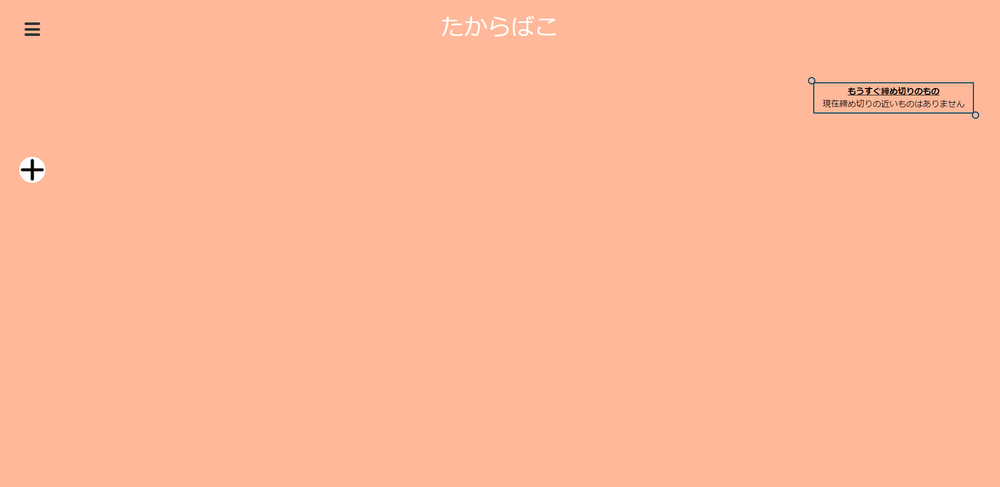

# Third_year-group_exercise<!-- omit in toc -->
# ・ビルド手順書 
 
 

## 1. ドキュメント作成者

-  越智陸仁

## 2. 改訂履歴

- 1.0:
  - 作成日時: 2022-02-1
  - 更新内容: 初版作成

## 3. このドキュメントの目次

- [1. ドキュメント作成者](#1-ドキュメント作成者)
- [2. 改訂履歴](#2-改訂履歴)
- [3. このドキュメントの目次](#3-このドキュメントの目次)
- [4. このドキュメントの目的・概要](#4-このドキュメントの目的概要)
- [5. 前提条件](#5-前提条件)
- [6. 作業端末](#6-作業端末)
- [7. 手順書](#7-手順書)
  - [7.1. データベースの準備](#71-データベースの準備)
  - [7.2. データベースのテスト](#72-データベースのテスト)

## 4. このドキュメントの目的・概要

- グループにて制作したプロダクトである「たからばこ」の実行手順を記載したもの。

## 5. 前提条件

- 作業用端末に、XAMPP等の実行環境がインストール済みであること。
- 作業用端末においてPHPが実行できる環境がインストール済みであること。

## 6. 作業端末

自端末(OS:Windows10)

## 7. 手順書

### 7.1. データベースの準備

- XAMPPを起動し、`phpMyAdmin`へアクセスする。
- `Takarabako\sql.txt` の内容をコピーし、SQLタブにペーストする。
- SQL文を実行する。

### 7.2. データベースのテスト

- インターネットブラウザを開き、[たからばこホームページ](http://localhost/Takarabako/HP.php)へアクセスする。
- テスト用アカウント(Mail:`kobe@denshi.net` PassWord:`kdkd`)にてログインする。
- 画像のような画面に遷移すれば完了。

  

